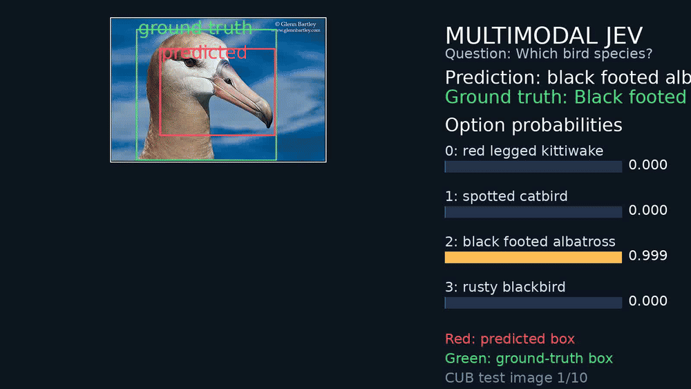

# Multimodal JEV Grounding

Ask a question. Get probabilities. See where the model looked.

This project turns a vision-language model into a structured decision system:

```text
image + question + candidate options
                  ↓
        multimodal JEV model
          ↙              ↘
 option probabilities   bounding box
```

Built with Qwen2.5-VL-3B-Instruct, LoRA, and a lightweight box-regression head. It was trained on CUB-200-2011 and returns option probabilities plus an object box.

## Demo

[Download the annotated demo video](cub_jev_demo.mp4)



Each frame shows option probabilities, the predicted box in red, and the ground-truth box in green.

## Results

The completed experiment used eight NVIDIA A100 40 GB GPUs for three epochs:

| Metric | Validation result |
|---|---:|
| Four-way option accuracy | **96.49%** |
| Mean bounding-box IoU | **0.535** |

The classification result is strong for the four-choice task. The box result is a useful prototype: the model generally finds the bird, but localization is not yet tight enough to call it strong grounding. The task uses four candidate species per image, not all 200 species simultaneously.

## Why JEV?

Instead of asking a language model to generate JSON, JEV reads the logits of a predefined answer set. The four candidate labels are scored directly:

```text
logits for 0, 1, 2, 3 → softmax → option probabilities
```

This avoids autoregressive JSON decoding and gives downstream systems a compact interface. The grounding branch adds the visual answer: not just what the model chose, but where the relevant object is.

## Simple JEV compatibility and current limitations

The option-probability calculation follows the same core idea as Simple JEV: select the permitted next-token logits and apply a numerically stable softmax over only those labels. The hard-label option loss is also equivalent to selected-label cross-entropy.

This repository is currently a simplified multimodal extension, not a drop-in implementation of Simple JEV v1. In particular:

- the prototype uses exactly four numeric labels, `0`–`3`;
- Simple JEV’s general choice protocol supports up to 50 dynamically mapped candidates;
- the prototype uses a custom multimodal prompt instead of the full v1 JSON-style prompt contract;
- the prototype does not yet map arbitrary public option IDs to Simple JEV’s internal answer symbols;
- label validation is currently simpler than Simple JEV’s exact rendered-boundary token-stability check;
- bounding-box prediction is an additional regression branch that is not part of Simple JEV’s original scorer.

Therefore, the current model should be described as **JEV-style multimodal grounding**. Supporting the full Simple JEV contract would require dynamic option labels, public-label mapping, exact prompt-boundary validation, and reuse of the versioned v1 prompt/scoring modules.

## Dataset: CUB-200-2011

CUB-200-2011 contains 11,788 bird images across 200 species and provides one object bounding box per image. See the [official Caltech page](https://www.vision.caltech.edu/datasets/cub_200_2011/).

`prepare_cub.py` reads the annotations, converts `x, y, width, height` boxes to normalized `x1, y1, x2, y2`, preserves the official test split, creates validation data from the training split, and samples three distractor species per image.

Generated split sizes:

```text
training:   5,395 images
validation:   599 images
test:       5,794 images
```

Example record:

```json
{
  "image": "/path/to/image.jpg",
  "options": ["species_a", "species_b", "species_c", "species_d"],
  "answer_index": 2,
  "box": [0.12, 0.08, 0.77, 0.99]
}
```

Check CUB’s distribution terms before redistributing the images or using them commercially.

## Quick start

```bash
python -m pip install -r requirements.txt
python prepare_cub.py --data-root data --output data/cub_records
```

## Training

```bash
CUDA_VISIBLE_DEVICES=0,1,2,3,4,5,6,7 \
torchrun --standalone --nproc_per_node=8 train_multimodal_jev.py \
  --model Qwen/Qwen2.5-VL-3B-Instruct \
  --train data/cub_records/train.jsonl \
  --validation data/cub_records/validation.jsonl \
  --output runs/cub-jev-8gpu \
  --lora --epochs 3 --batch-size 1 \
  --gradient-accumulation 8 --lr 1e-5 --box-weight 5.0
```

The trainer uses DistributedDataParallel, LoRA adapters, and a trainable four-coordinate box head.

## Loss function

```text
L_option = CrossEntropy(option_logits, correct_option)
L_box    = SmoothL1(predicted_box, target_box)
L_total  = L_option + 5.0 * L_box
```

The box weight `5.0` is an initial experiment setting. Corners are ordered before loss and inference so `x1 <= x2` and `y1 <= y2`.

## Inference

```bash
python infer_multimodal_jev.py \
  --model Qwen/Qwen2.5-VL-3B-Instruct \
  --adapter runs/cub-jev-8gpu/epoch-3-adapter \
  --box-checkpoint runs/cub-jev-8gpu/epoch-3-box.pt \
  --record data/cub_records/test.jsonl \
  --record-id cub_00001
```

The output contains the selected option, probabilities, normalized coordinates, and pixel-space coordinates. Custom inference accepts `--image`, `--question`, and exactly four `--options`.

## Files

| File | Purpose |
|---|---|
| `prepare_cub.py` | Download and format CUB |
| `train_multimodal_jev.py` | LoRA + option scoring + box regression |
| `infer_multimodal_jev.py` | Structured single-image inference |
| `make_demo_video.py` | Annotated MP4 generation |
| `REPORT.md` | Experiment write-up |

## Next experiments

- evaluate all 200 species instead of four sampled options;
- report AP50, AP75, and thresholded recall in addition to mean IoU;
- add GIoU or CIoU loss;
- train explicit grounding questions such as “Where is the bird?”;
- pool visual tokens more deliberately;
- compare against a dedicated detector or grounding model.

## Citation

This project builds on the JEV-style selected-logit approach explored by [Featherless AI’s Simple JEV](https://github.com/featherless-ai/simple-jev/tree/main).

```text
Wah, C., Branson, S., Welinder, P., Perona, P., and Belongie, S.
The Caltech-UCSD Birds-200-2011 Dataset.
California Institute of Technology, CNS-TR-2011-001, 2011.
```
